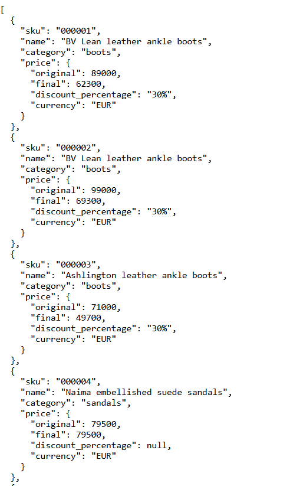
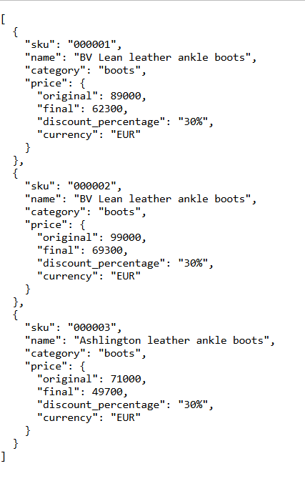
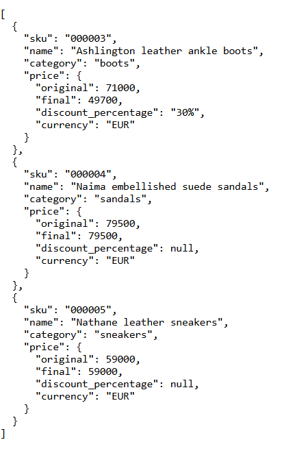
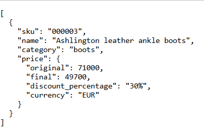

# 🛒 Challenge

A Symfony-based API that exposes a `/products` endpoint with filtering and dynamic discounts based on category or product. 
Built following **DDD + Hexagonal Architecture** principles, with Redis caching and PostgreSQL persistence.

---

## 📁 Project Structure

```bash
src/
├── Catalog                      # 🧠 Catalog bounded context
│   ├── Application              # 📦 Application layer (use cases)
│   │   └── Search
│   │       ├── Resource         # DTOs
│   │       │   ├── PriceResource.php
│   │       │   └── ProductResource.php
│   │       ├── SearchProductQuery.php
│   │       └── SearchProductUseCase.php
│   ├── Domain                   # 🔍 Domain layer (entities, value objects)
│   │   ├── Model
│   │   │   ├── Discount.php
│   │   │   └── Product.php
│   │   ├── Repository
│   │   │   ├── ProductCriteria.php
│   │   │   └── ProductRepository.php
│   │   └── ValueObject
│   │       └── Price.php
│   └── Infrastructure           # 🛠️ Infrastructure layer (adapters)
│       ├── Api
│       │   └── Controller
│       │       └── SearchProductController.php
│       └── Doctrine
│           ├── Entity
│           ├── Mapper
│           └── Repository
├── Shared                       # ♻️ Shared logic across contexts
│   ├── Domain
│   │   └── CacheService.php
│   └── Infrastructure
│       ├── Cache (Redis)
│       └── Doctrine (Migrations)
└── Kernel.php                  
```

The proposed structure is based on the Product Catalog context, which has a clearly defined domain.
When we talk about products, categories, prices, and discounts, it's evident that all these concepts belong 
within this context.

Following Domain-Driven Design (DDD) principles, the domain layer is isolated from the infrastructure layer.
This is reflected in how the domain models are separated from the persistence entities defined under the 
infrastructure layer.

Not all entities have been fully modeled—only those that are relevant for this use case. For example:
Product and Discount are modeled as full entities, since they have their own identity and life cycle.
Category and Price, on the other hand, are modeled as Value Objects, since their values are immutable 
and they do not have identity.

Additionally, the project follows Hexagonal Architecture (Ports and Adapters).
This ensures that the core domain logic is decoupled from external systems, such as databases or APIs.
We can clearly see dependency inversion at play: the domain defines interfaces (contracts), and the infrastructure implements them—ensuring that the domain never depends on external details.

Regarding the API, there is a single use case to search for products.
This uses the Specification/Criteria pattern to apply filtering logic dynamically based on query parameters like category and price.

To address potential performance issues, a cache system is used to serve data as quickly as possible without querying the database on every request.
This approach is especially beneficial when dealing with a large number of products and discounts, since applying filtering and discount logic on each request could become expensive.

---

## 🧰 Tech Stack

| Tool         | Description                |
|--------------|----------------------------|
| ⚙️ Symfony    | Web framework (6.4)        |
| 🗄️ PHP        | Version 8.3                |
| 🐘 PostgreSQL | Relational DB (Docker)     |
| 🔌 Redis      | Cache backend              |
| 🐳 Docker     | Containerized environment  |
| 🛠️ Make       | Developer command runner   |

---

## 🚀 Getting Started

### 1. Clone the project

```bash
git clone git@github.com:rfiallossanchez/mytheresa-challenge.git
cd mytheresa-challenge
```

### 2. Launch services

```bash
make start-verbose
```

💡 If you don’t have `make`, run manually:

```bash
docker-compose -p challenge -f ./deploy/docker-compose.api.yaml up -d --remove-orphans
docker logs challenge-api -f
```

---

### 🛠️ Make Commands

| Command              | Description                                  |
|----------------------|----------------------------------------------|
| `make start-verbose` | 🚀 Start API container                       |
| `make build`         | 🛠️ Build Docker images                       |
| `make stop`          | ⛔ Stop all running services                 |
| `make bash-api`      | 🐚 Enter API container                       |
| `make bash-db`       | 🐘 Enter PostgreSQL container                |
| `make logs-api`      | 📄 Tail logs from API                        |
| `make test-api`      | 🧪 Run all unit tests                        |
| `make help`          | 📖 List all available commands               |

---

## 🔍 Example API Usage

### 📦 Fetch all products

```bash
curl http://localhost:8080/products
```


### 🔍 Filter by category

```bash
curl http://localhost:8080/products?category=boots
```


### 💸 Filter by price

```bash
curl http://localhost:8080/products?priceLessThan=80000
```


### 🧪 Combined filter

```bash
curl http://localhost:8080/products?category=boots&priceLessThan=80000
```


---

## 🧪 Running Tests

```bash
make test-api
```

Or manually:

```bash
docker exec -it challenge-api php bin/phpunit
```